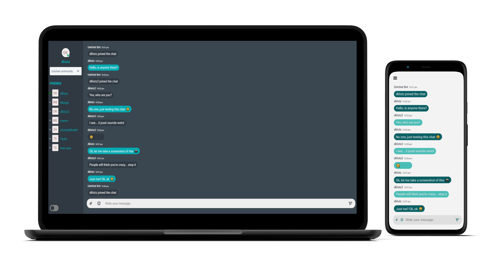

# Unichat - ReactJs Group Chat  

### This is a ReactJs project made for fun.

### :collision: Tech Stack

- ReactJs
- Redux
- Styled Components
- Socket.io
- Firebase
- AWS Aplify
- Nginx
- Amazon EC2

### :electric_plug: Requeriments

- Node.JS >= 12.16.2

### :computer: Getting started 
- npm i
- npm start
- [Start the backend](https://github.com/d-klotz/uni-chat-backend)

:heavy_exclamation_mark: The frontend project will start on port 3000

### <a href="http://linkedin.com/in/danielfelipeklotz">Contact me on LinkedIn</a>
